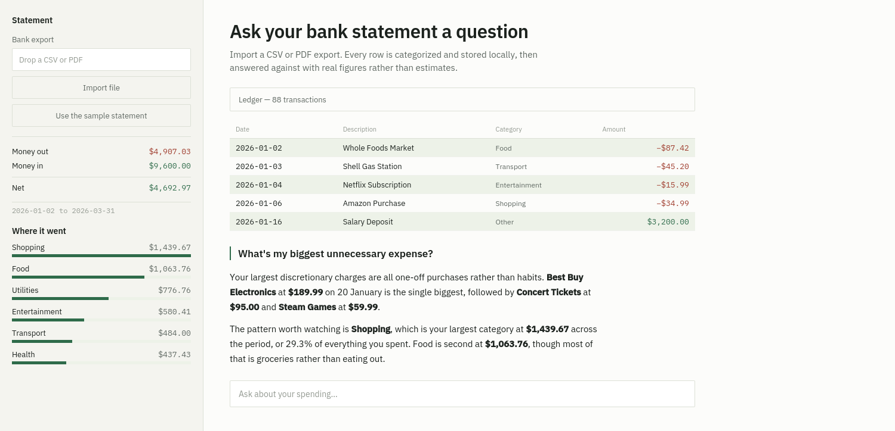

# Finance Intelligence Agent

**Import a bank export, and ask questions about it in plain English. The answers come from SQL and pandas over your actual rows, not from the model's impression of them.**



A language model is bad at arithmetic over eighty transactions and good at deciding which query answers your question. So this splits the work. Five tools do the counting — read-only SQL, category totals, period summaries, a discretionary-spend ranking, and a budget calculation — and the agent picks between them and writes up what comes back. Every figure in an answer traces to a row in SQLite.

Ask "how much did I spend on food last month" and it calls `get_category_spending`. Ask "what's my biggest unnecessary expense" and it calls `find_largest_discretionary_expenses`, because there is no column for "unnecessary" and something has to make that judgment call.

## Before you point it at your own bank data

This runs locally, but it is not private. Worth understanding exactly what leaves your machine:

- **Asking a question sends transaction data to the model.** Tool results — merchant names, amounts, dates — go into the conversation with Orq.ai's router so the agent can write its answer. Your statement is not staying on your laptop.
- **PDF import sends the whole statement.** The extracted text of the entire PDF goes to the model in one prompt for parsing. CSV import does not do this; it is pure pandas.
- **`finance.db` is your data.** It sits next to the code and is gitignored for that reason. Delete it, or use Clear everything, before sharing the folder.

For a demo on the bundled synthetic CSV none of this matters. For your real statement, it should be a deliberate choice.

## Categorization is keyword matching

Not a classifier, not the LLM — a list of substrings per category in `agent.py`. This is fast, free, and predictable, and it is wrong at the edges in ways you should know about:

- Merchants that sell everything land wherever the list puts them. `walmart` is filed under Food, so a Walmart TV is grocery spending.
- Anything unrecognized becomes Other, which quietly inflates that bucket on real exports where descriptions are terse (`SQ *AB12CD`, `POS DEBIT 0491`).
- Order matters. Utilities is checked before Transport so a "Gas & Electric" bill is not filed as fuel.

Adding a keyword to `CATEGORY_KEYWORDS` is the intended way to improve it, and it takes about ten seconds per merchant.

## Setup

Python 3.10+ and an [Orq.ai](https://orq.ai/) key.

```bash
git clone https://github.com/hariharan-sabapathi/Finance-Intelligence-Agent

python -m venv venv
source venv/bin/activate          # Windows: venv\Scripts\activate
pip install -r requirements.txt

cp .env.example .env              # then add ORQ_API_KEY
streamlit run app.py
```

Click **Use the sample statement** to try it on 88 synthetic transactions spanning January to March 2026. `ORQ_MODEL` overrides the default `deepseek-v4-flash`.

## What it accepts

| Input | Handling |
| --- | --- |
| CSV with `date`, `description`, `amount` | Read directly by pandas |
| CSV with aliases (`transaction_date`, `memo`, `narrative`, `merchant`) | Renamed on import |
| CSV with separate `debit` / `credit` columns | Combined into one signed amount |
| Amounts as `$1,234.56` or `(45.20)` | Cleaned, parentheses read as negative |
| Text-based PDF statement | Text extracted with PyMuPDF, then parsed by the model into JSON |
| Scanned or image-only PDF | Will not work. There is no OCR step. |

Each import replaces the previous dataset. There is no merging and no deduplication.

## The tools

| Tool | Answers |
| --- | --- |
| `query_transactions_sql` | Anything the others don't. SELECT only, blocked from mutating statements by a regex check |
| `summarize_spending` | Totals and top merchants for all time, this month, last month, or the last 7 days |
| `get_category_spending` | One category over one of those periods |
| `find_largest_discretionary_expenses` | Biggest single charges across Entertainment, Shopping, and Food |
| `suggest_weekly_budget` | Weekly caps proportional to past spending, with 10% trimmed off the discretionary categories |

## Known rough edges

- **"Last month" means two things.** The system prompt is given today's real date, but the period filters compute relative to the newest transaction in your data. On the sample statement, which ends in March 2026, "last month" is February 2026 regardless of when you run it. Fine for a demo, confusing on stale data.
- **Income detection is `amount > 0`.** A refund counts as income and is excluded from spending totals.
- **The SQL guard is a regex.** It blocks the obvious mutations and only allows statements starting with SELECT. It is not a substitute for opening a genuinely read-only connection.
- **No multi-account support.** One table, one dataset, one currency, and the formatting is hardcoded to USD.
- **Budget suggestions are arithmetic, not advice.** `suggest_weekly_budget` divides past spending by elapsed weeks and shaves 10% off three categories. It knows nothing about your income, rent, or obligations.

## Layout

```text
Finance-Intelligence-Agent/
├── app.py             # Streamlit UI
├── agent.py           # ingestion, categorization, tools, agent graph
├── transactions.csv   # 88 synthetic transactions
├── requirements.txt
├── .env.example
├── .gitignore
├── .streamlit/config.toml
└── assets/
    ├── demo.png
    └── demo.gif
```
